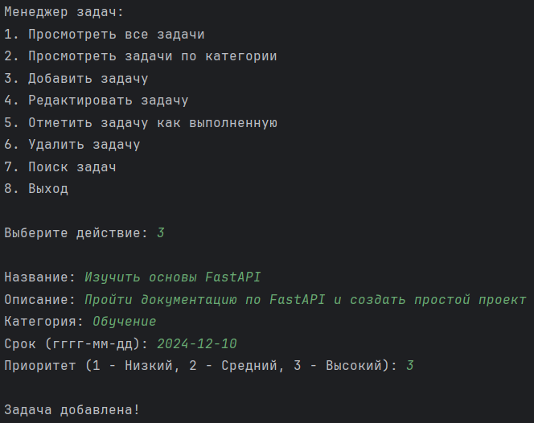
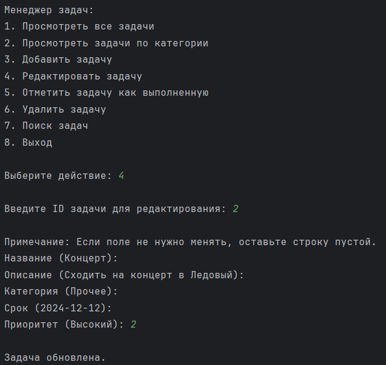
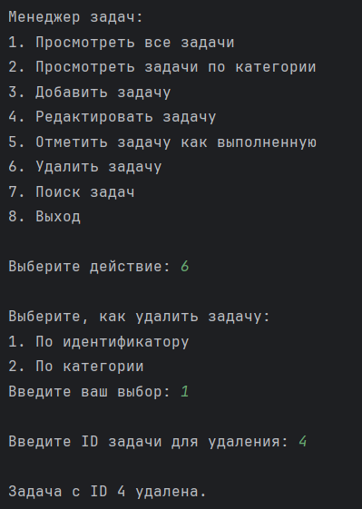
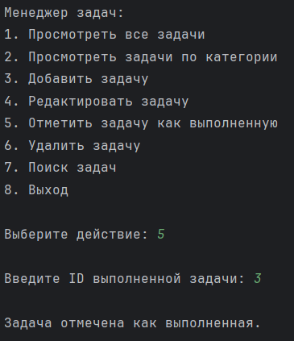
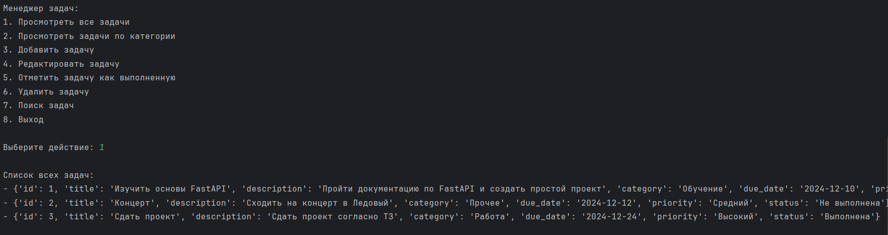
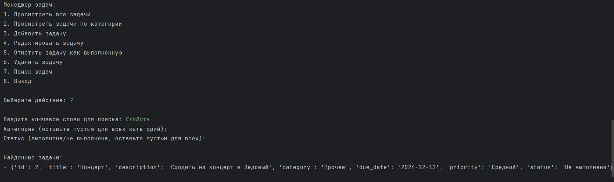

# Менеджера Задач

## Описание

Менеджер задач - это приложение, позволяющее пользователю добавлять, редактировать, удалять и просматривать задачи. Каждая задача может иметь название, описание, срок выполнения, приоритет и категорию.

## Установка

1. Клонируйте репозиторий:

   ```
   git clone https://github.com/Thorch3n/task_manager
    ```
2. Установите необходимые зависимости:
    ```bash
   pip install -r requirements.txt
   ```
3. Запустите приложение:
    ```bash
   python task_manager.py
   ```
## Структура проекта

- `task_manager.py` - Основной файл, который запускает менеджер задач и предоставляет пользователю интерфейс для взаимодействия с задачами.
- `models.py` - Содержит классы и логику для управления задачами, включая добавление, удаление, редактирование и сохранение задач.
- `handlers/` - Содержит функции для обработки различных действий, таких как добавление, редактирование, удаление и выполнение задач.
- `utils.py` - Вспомогательные функции для валидации ввода пользователя.
- `data.json` - Файл для хранения задач.

## Использование

### Главная функция
При запуске программы пользователю будет предложено выбрать одно из следующих действий:

1. Просмотреть все задачи.
2. Просмотреть задачи по категории.
3. Добавить задачу.
4. Редактировать задачу.
5. Отметить задачу как выполненную.
6. Удалить задачу.
7. Поиск задач.
8. Выход.

### Функции
`add_task`

Функция для добавления новой задачи.

- Запрашивает:

  - Название задачи (обязательно).
  - Описание задачи (обязательно).
  - Категорию задачи (1 - Работа, 2 - Обучение, 3 - Прочее).
  - Срок выполнения задачи (в формате дд-мм-гггг).
  - Приоритет задачи (1 - Низкий, 2 - Средний, 3 - Высокий).
- Добавляет задачу в список задач и сохраняет.

#### Пример использования:
 
 
`edit_task`
Функция для редактирования существующей задачи.

- Запрашивает:

  - ID задачи, которую необходимо редактировать.
  - Новое название задачи (если оставлено пустым, не меняется).
  - Новое описание задачи (если оставлено пустым, не меняется).
  - Новую категорию задачи (если оставлена пустой, не меняется).
  - Новый срок выполнения (если оставлен пустым, не меняется).
  - Новый приоритет задачи (если оставлен пустым, не меняется).
- Сохраняет изменения в задаче.

#### Пример использования:


`delete_task`
Функция для удаления задачи по ID.

- Запрашивает ID задачи или название категории для удаления задач(-и).
- Удаляет задачу из списка.

#### Пример использования:


`complete_task`

Функция для отметки задачи как выполненной.

- Запрашивает ID задачи для отметки.
- Отмечает задачу как выполненную.

#### Пример использования:


`view_tasks`
Функция для просмотра всех задач.

#### Пример использования:


`search_tasks`
Функция для поиска задач по ключевым словам в названии или описании.

#### Пример использования:


## Валидация ввода
Для обеспечения корректности данных используются следующие функции валидации:
- `validate_non_empty`: проверяет, что ввод не является пустым.
- `validate_date_format`: проверяет правильность формата даты.
- `validate_priority`: проверяет, что приоритет задачи является одним из значений 1, 2, 3.

## Формат даты
Дата должна быть в формате `дд-мм-гггг`.

